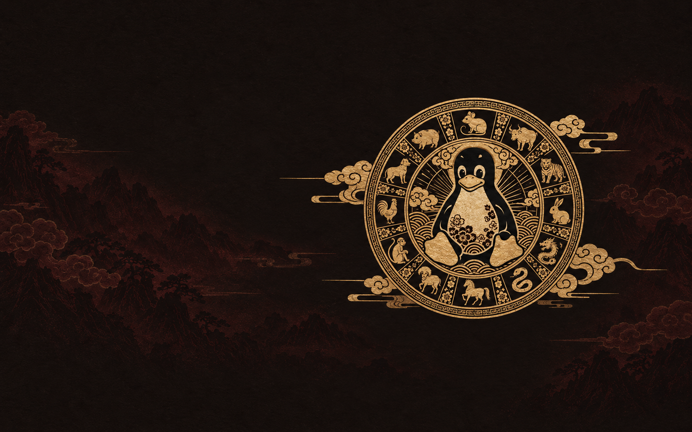

# Year of the Linux Desktop

<a href="https://github.com/tcballard/omarchy-badges"></a>

A Chinese zodiac-inspired dark theme for Omarchy Quattro: warm ink, oxblood selections, parchment text and antique-gold accents.



## Install

After the theme PR is merged into the default branch:

```bash
omarchy theme install https://github.com/tcballard/omarchy-theme-year-linux-desktop
```

Omarchy installs and applies the theme. Its current installer replaces any existing theme at the same destination. This repository's name resolves to `theme-year-linux-desktop` in Omarchy; its displayed name is derived from that slug.

**Target:** Quattro's semantic `colors.toml` format. **Status:** 0.1.0 candidate; palette and template checks passed, live XPS/Quattro testing remains outstanding. No installed Omarchy version has been tested yet.

## Five wallpapers

| Wallpaper | Design |
| --- | --- |
| **01 · Ink & Gold — default** | The off-centre Tux medallion, dark ink and oxblood details; text-free |
| **02 · Oxblood Celebration** | Original centred design and lettering, recoloured from bright red to deep oxblood |
| **03 · Moon Gate** | Moonlit garden, plum blossoms and Tux |
| **04 · Ten Thousand Mountains** | Panoramic mountains with Tux tucked into the landscape |
| **05 · Zodiac Procession** | Gold zodiac animals and Tux across vermilion |

On a fresh selection, Omarchy chooses the first background in filename order, so the off-centre artwork is named `01-ink-and-gold.png`. Use the background picker for the others. User-added backgrounds or an existing background selection can affect subsequent choices; the theme does not override those preferences.

<details>
<summary>See the alternatives</summary>


</details>

## Native desktop colours

Gold active-window borders, parchment text and oxblood selections carry the wallpaper palette into the shell and supported applications. Coral errors, jade success and amber warnings stay distinct. Omarchy's fonts, spacing, scaling and keyboard behaviour remain native.

`colors.toml` is the source of truth. Installed Omarchy templates generate shell, terminal, editor and other supported app configurations. There is no full `shell.toml` replacement. User templates and app preferences can affect the result. The current GTK hook selects dark mode and Adwaita-dark; it does not apply a custom gold GTK palette.

See [DESIGN.md](DESIGN.md) for application coverage and [VALIDATION.md](VALIDATION.md) for measured checks. All five images are 1586 × 992, approximately 16:10, not native 3K/4K exports.

## Try the PR before merging

Clone this branch into a new directory and run the installer, which refuses to overwrite an existing theme:

```bash
git clone --branch feat/oxblood-theme https://github.com/tcballard/omarchy-theme-year-linux-desktop.git
cd omarchy-theme-year-linux-desktop
bash scripts/install-local.sh
omarchy theme set theme-year-linux-desktop
```

The local installer copies Git provenance with the theme, records the previous theme/background for reference, and leaves activation to the last command. To restore your desktop, choose the previous theme and wallpaper in Omarchy's pickers. No root access is needed.

## Credits and release status

[Artwork provenance and mascot attribution](CREDITS.md). Licensed under the [MIT License](LICENSE). A real desktop preview and live XPS verification remain release preparation tasks. The images above are wallpapers, not fabricated desktop screenshots. This is an independent community theme.
