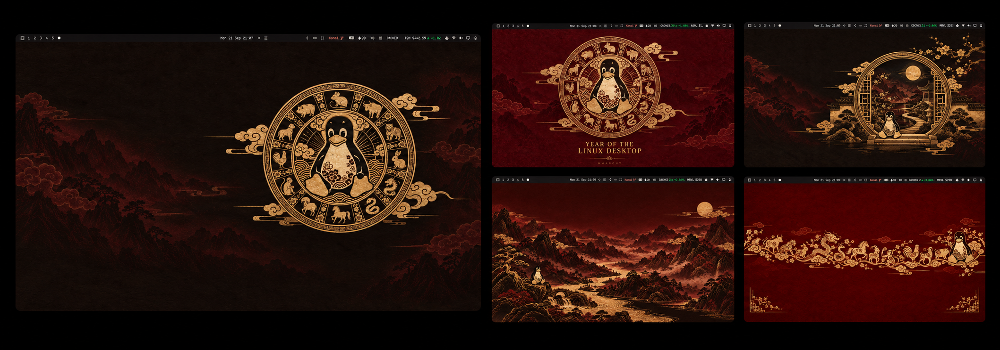
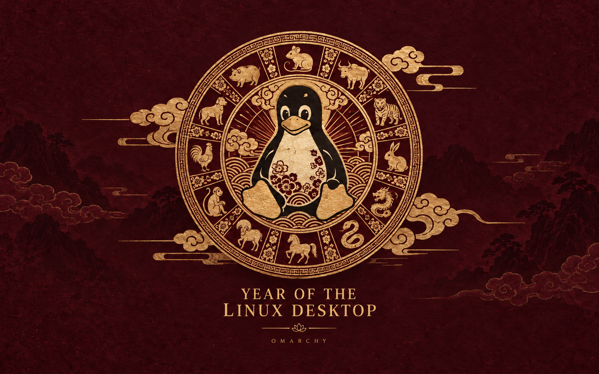
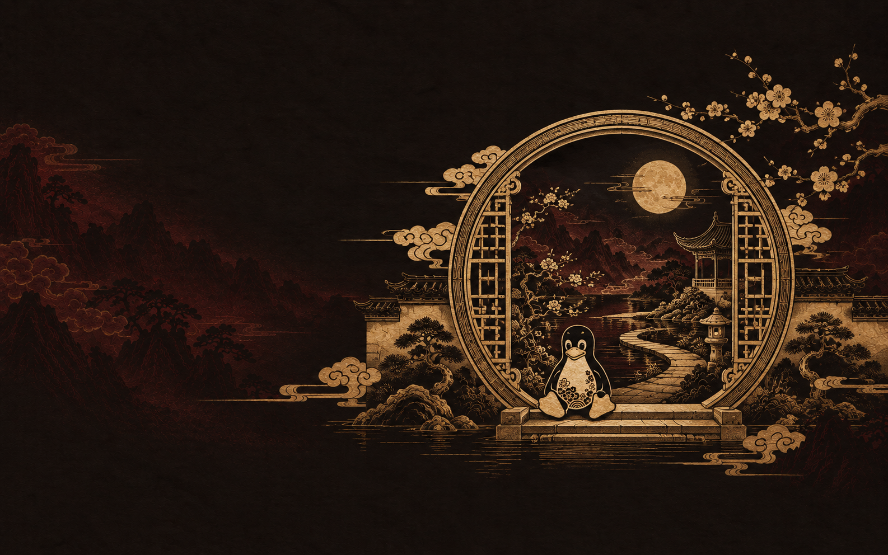
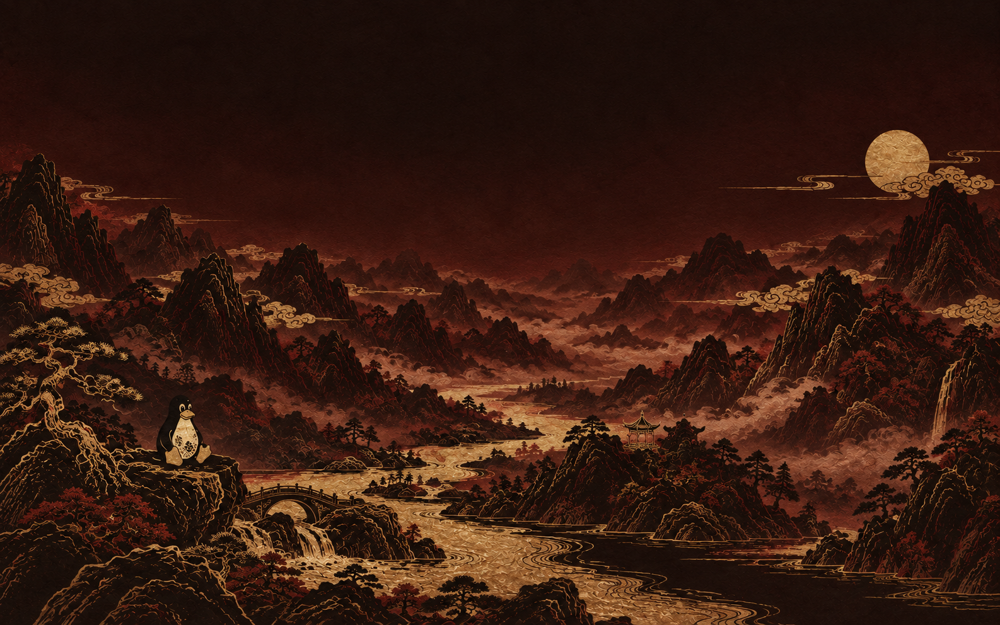
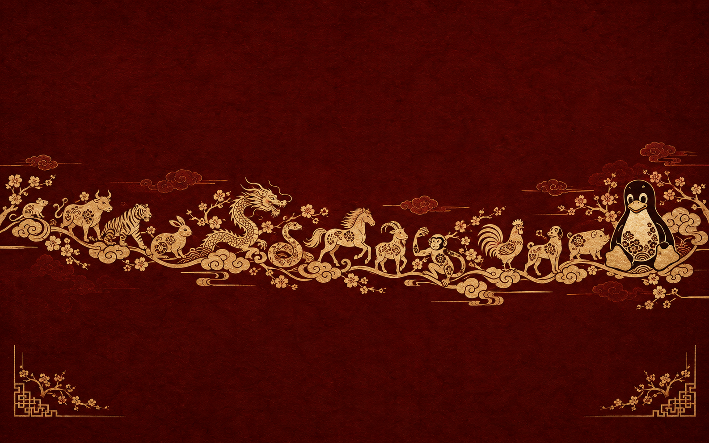

# Year of the Linux Desktop

[](https://github.com/tcballard/omarchy-badges)

**Every year gets an animal. This one gets a penguin.**

A Chinese zodiac-inspired dark theme for Omarchy Quattro, with Tux at the centre of the celebration. Warm ink, deep oxblood and antique gold give the desktop its character, with parchment-coloured text to keep things readable.

Captured on my Dell XPS running Omarchy. The preview brings together all five desktop screenshots.



## Try it

```sh
omarchy theme install https://github.com/tcballard/omarchy-theme-year-linux-desktop
```

The installer applies the theme immediately. Choose a wallpaper with Omarchy’s background picker, or switch back through the theme picker.

## Five ways to celebrate

Start with **Ink & Gold**, the quiet, off-centre Tux medallion. **Oxblood Celebration** puts him front and centre. **Moon Gate** takes him into a moonlit garden, **Ten Thousand Mountains** into a broad mountain landscape, and **Zodiac Procession** gives him a parade.

The same dark palette runs through all five: gold window borders, parchment text and oxblood selections.

<details>
<summary>See the other four wallpapers</summary>






</details>

Found something hard to read or out of place? [Open an issue](https://github.com/tcballard/omarchy-theme-year-linux-desktop/issues) with a screenshot.

For the details, see the [design notes](DESIGN.md) and [validation record](VALIDATION.md).

## Credits and licence

[MIT](LICENSE). Tux was originally created by Larry Ewing. [Artwork and attribution](CREDITS.md).
